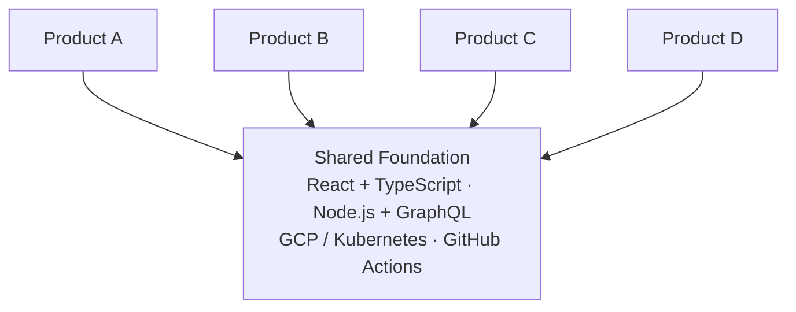
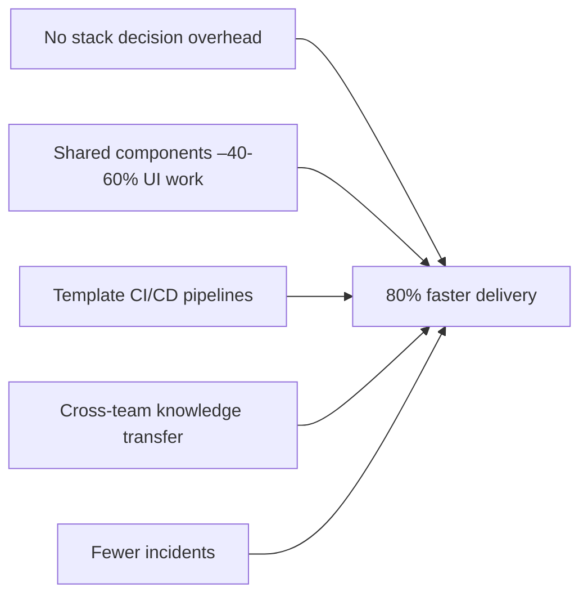

When I joined the product team at METRO France as a consultant via Wemanity Group, the engineering organization had a problem that wasn't obvious from the outside: each product was built in isolation.

Different teams had made different technology choices. Some products used one framework, others another. There was no shared component library, no common API conventions, no unified deployment strategy. Engineers couldn't move between products without a significant ramp-up period. Every new feature required reinventing decisions that had already been made elsewhere.

The result was predictable: slow onboarding, duplicated effort, fragile deployments, and a growing sense that the engineering organization couldn't keep up with the business.

This is the story of how we fixed it, and what I learned about the real cost of technical fragmentation.

## The Problem with "Good Enough" Diversity

Before the standardization effort, each product team had made independent technology choices: different frameworks, different databases, different CI pipelines. Every column was a silo. Engineers couldn't move between them. Nothing was reusable.

There's a seductive argument for letting teams choose their own tools: autonomy enables creativity, and each team knows its problem best. It's not entirely wrong. But at a certain scale, that autonomy becomes a tax.

At METRO France, the tax showed up in three ways:

**Onboarding latency.** A new engineer joining any team couldn't contribute for weeks because they had to learn a product-specific stack from scratch. There was no foundational knowledge that transferred.

**No reuse.** A component built by one team to solve a UX problem couldn't be used by another team, even when the problem was identical. Every team reinvented the same solutions.

**Deployment fragility.** Without shared infrastructure patterns, each product had its own deployment quirks. A fix in one pipeline didn't help the others. Incidents were isolated but frequent.

The business impact was clear: building a new product took months. Iterating on an existing one took longer than it should. Technical debt was accumulating silently across every codebase.

## Choosing a Standard That Actually Sticks

The first decision, and the most politically fraught one, was choosing the stack.

We landed on **TypeScript, React, Node.js, TypeORM, and GraphQL** for application development, with **GCP and Kubernetes** for infrastructure, and **GitHub Actions** for CI/CD.

This wasn't an arbitrary choice. Each technology was selected for a specific reason:

- **TypeScript** over plain JavaScript: type safety across codebases, better IDE support, and a shared contract between front-end and back-end teams.
- **React** for the front-end: large ecosystem, component reuse, and a talent pool deep enough to hire against.
- **Node.js + GraphQL** for the API layer: unified query interface, strong typing with code generation, and the ability to aggregate data sources without over-fetching.
- **GCP + Kubernetes**: already partially in use, well-documented, and scalable to the 93-warehouse operational footprint.

The key insight: **a standard only sticks if it's better for the teams, not just better on paper.** We chose technologies that were genuinely productive to work with, not the most fashionable or the most theoretically correct.

The shared base configuration made the standard concrete from day one:

```json
// tsconfig.base.json — inherited by all products
{
  "compilerOptions": {
    "target": "ES2022",
    "strict": true,
    "noImplicitAny": true,
    "noUncheckedIndexedAccess": true,
    "esModuleInterop": true,
    "moduleResolution": "bundler"
  }
}
```

Each product's `tsconfig.json` simply extended this base. One decision, made once, consistently enforced everywhere.

## Implementation: Adoption Before Enforcement

The biggest mistake organizations make when standardizing is mandating compliance before demonstrating value.

We took the opposite approach. Before asking any team to change their stack, we built a reference implementation: a small, real product using the new standard, shipped to production. It had to work, not just look good in a demo.

Once the reference existed, adoption spread faster than we expected. Engineers could see the patterns in action. They could ask questions with real examples in hand. The new standard wasn't a policy document. It was working code.

From there, we introduced shared tooling: a design system with reusable React components, shared TypeScript configs, ESLint rules that encoded architectural decisions, and a common CI/CD pipeline template that teams could copy and adapt.

New products were started on the new stack by default. Existing products were migrated incrementally, not all at once to avoid disruption, but module by module, as features were added or refactored.

The shared CI/CD template removed weeks of infrastructure setup per project:

```yaml
# .github/workflows/ci.yml — reusable across all products
name: CI
on: [push, pull_request]
jobs:
  build-and-test:
    runs-on: ubuntu-latest
    steps:
      - uses: actions/checkout@v4
      - uses: actions/setup-node@v4
        with:
          node-version: 20
          cache: 'npm'
      - run: npm ci
      - run: npm run lint
      - run: npm run build
      - run: npm test
      - uses: ./.github/actions/deploy-gcp
        if: github.ref == 'refs/heads/main'
```

After standardization, the same four columns looked like this:



Any engineer could contribute to any product from day one.

## The Bonus Management Product: A Case Study Within the Case Study

The most concrete example of what this standardization enabled was the bonus management product.

METRO France's 93 warehouses had been managing employee bonuses through spreadsheets. Store managers filled in data manually, HR consolidated it with significant lag, and errors were frequent. The process was time-consuming, unauditable, and a recurring source of employee dissatisfaction.

Building this product in the old world would have required months of setup, custom tooling, and a team that couldn't be reused elsewhere afterward.

In the new world, we built it on the standardized stack from day one. We reused shared components for the UI. The GraphQL API followed established patterns. The deployment pipeline was templated. The team that built it had already worked on other products in the new stack and hit the ground running.

The product launched across all 93 warehouses nationally. Bonus calculations moved from spreadsheets to an auditable digital system. Store managers reported faster processing. HR freed up significant time. Employee satisfaction scores in warehouses improved measurably.

But beyond the product itself, the most significant outcome was what it demonstrated: **the standardized stack had become a multiplier**. Building this product took a fraction of the time it would have taken before.

## The 80% Number

The 80% acceleration in product creation cycles that we measured wasn't magic: it was the sum of several compounding effects:



1. **No stack decision overhead.** Teams started building immediately, not deliberating over technology choices.
2. **Shared components reduced UI work** by 40–60% on new products.
3. **Template CI/CD pipelines** eliminated weeks of infrastructure setup per project.
4. **Cross-team knowledge transfer** meant engineers could contribute to any product from day one.
5. **Fewer incidents** from better-understood, better-documented infrastructure patterns.

Each of these alone would have been meaningful. Together, they transformed how fast the organization could ship.

## What Engineering Leaders Should Know

If you're considering a standardization effort in your organization, here's what I'd pass on from this experience:

**Start with the pain.** The case for standardization needs to be grounded in real problems, not theoretical elegance. Show the onboarding cost. Show the duplicated effort. Show the deployment incidents. Make the current state's cost legible.

**Build before you mandate.** A reference implementation is worth ten strategy documents. Ship something real, then show people why the new way is better.

**Standardize the decisions, not the tools.** The goal isn't uniformity for its own sake: it's reducing decision fatigue and enabling reuse. A standard TypeScript config is more valuable than a standard framework, because it removes a low-level decision without constraining higher-level architecture.

**Expect gradual migration.** Rewriting everything at once is a way to break things and burn engineers out. Migrate incrementally, product by product, module by module. New projects adopt the standard by default; existing ones migrate as they evolve.

**Measure the outcome, not the process.** The metric that matters is delivery velocity, not "percentage of products on the new stack." Track what you actually care about.

---

Standardizing a tech stack is, at its core, a bet that shared infrastructure creates more value than individual autonomy. At METRO France, that bet paid off clearly: faster delivery, better products, and an engineering team that could work together rather than in parallel silos.

The 80% figure is real, but the more important thing it represents is this: when engineers stop reinventing the same decisions over and over, they can spend that time building things that actually matter to users.

That, more than any specific technology, is the point.
